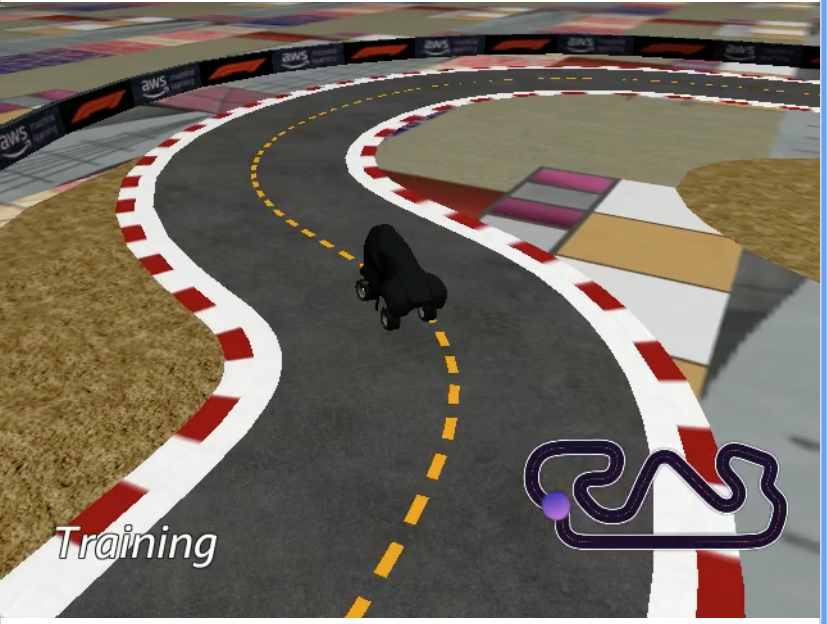
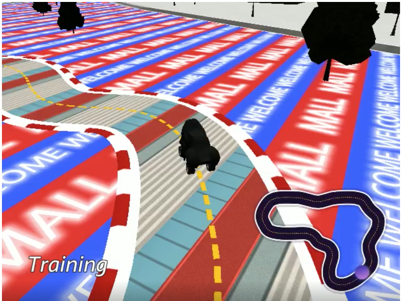
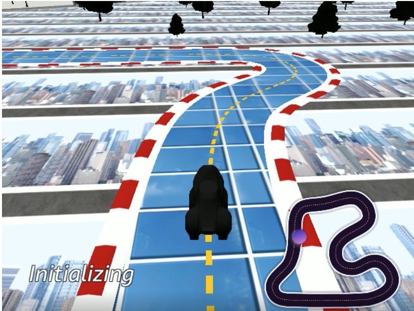

# DeepRacer Advanced Training for AWS DeepRacer Console

This project provides helping scripts to automate the training of DeepRacer models using the official AWS DeepRacer console for re-inforcement learning.

# Installation

## Randomize the environment
One big problem with Deeracer is overfitting to the virtual environment. This can be prevented by randomizing the world (textures and tracks). While manipulating the environment in a local training setup is rather easy, doing this in the official console is only possible by modifying the official deepracer simulation application. A set of scripts for doing this is provided in this repository. 

Here are some impressions:

## Increase Speed
1. Start a new DeepRacer job
2. Get the Robomaker ARN from the Robomaker Console
3. execute ./increase_speed.py \<robomaker arn\> \<time in minutes\> \<percentage increase\> (e.g. ./increase_speed.py "arn:aws:robomaker:us-east-1:000000000:simulation-job/sim-6z3jfvryz3dh" 120 1.10)
